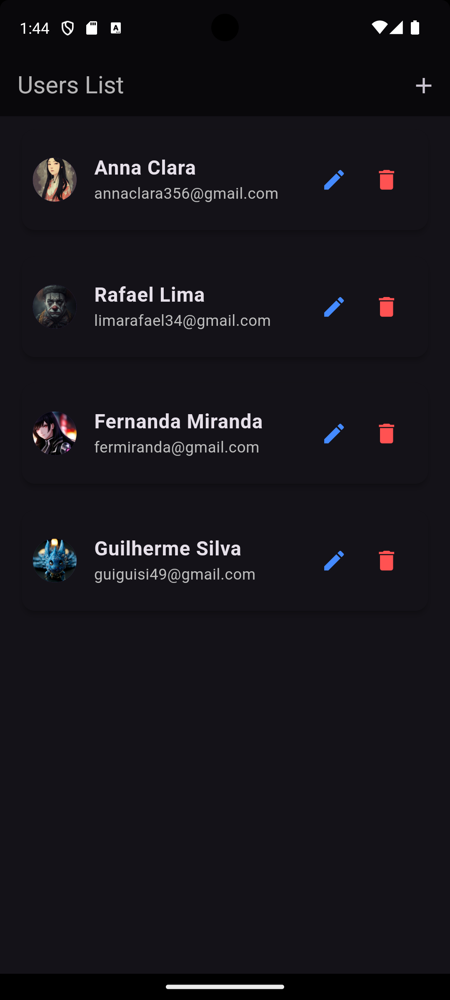
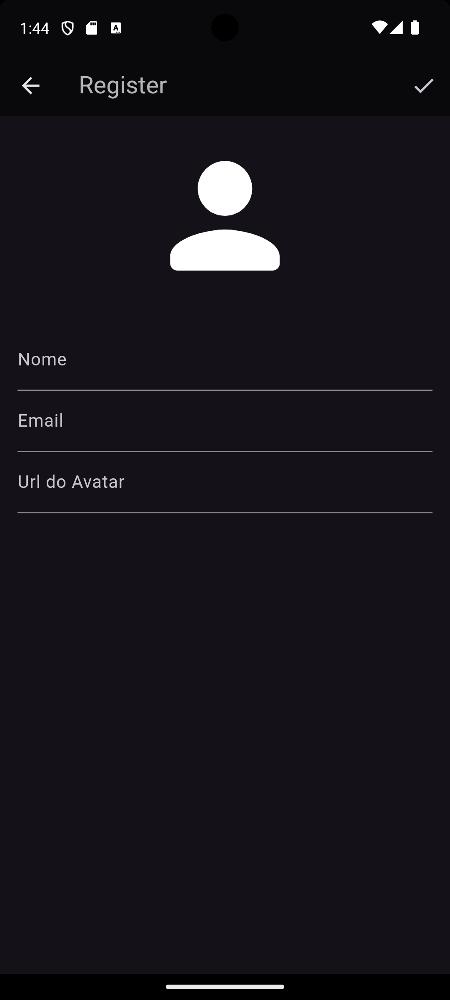
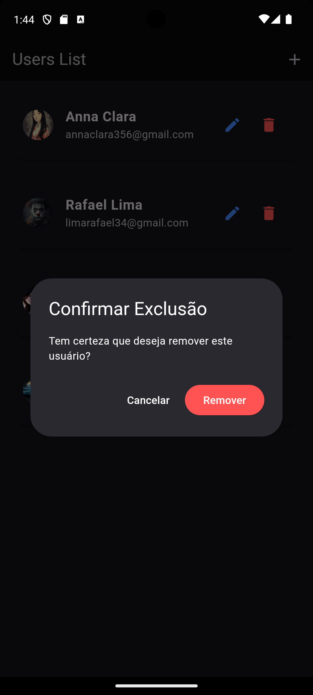

# Registro de Usuários  

Esta é uma aplicação móvel desenvolvida como parte do aprendizado em **Flutter**. A aplicação oferece funcionalidades básicas, como cadastro, edição e exclusão de contas de usuários. Para simplificar o desenvolvimento e o aprendizado, os dados são armazenados localmente no dispositivo, sem conexão com bancos de dados externos.  

## 🎯 Funcionalidades  

- **Cadastro de Usuários**: Permite registrar novos usuários com suas informações pessoais.  
- **Edição de Dados**: Possibilita atualizar informações do perfil do usuário a qualquer momento.  
- **Exclusão de Conta**: Remove permanentemente a conta de um usuário e seus dados.  

### 📸 Capturas de Tela  

    
    
    

  

    
    

  

## 🛠️ Tecnologias Utilizadas  

- **Dart**: Linguagem principal utilizada no desenvolvimento.  
- **Flutter**: Framework para criação de interfaces móveis modernas.  

## 📂 Armazenamento de Dados  

Os dados dos usuários são armazenados localmente no dispositivo, utilizando soluções de armazenamento interno. Essa abordagem é suficiente para fins de aprendizado e não requer a integração com bancos de dados externos.  
